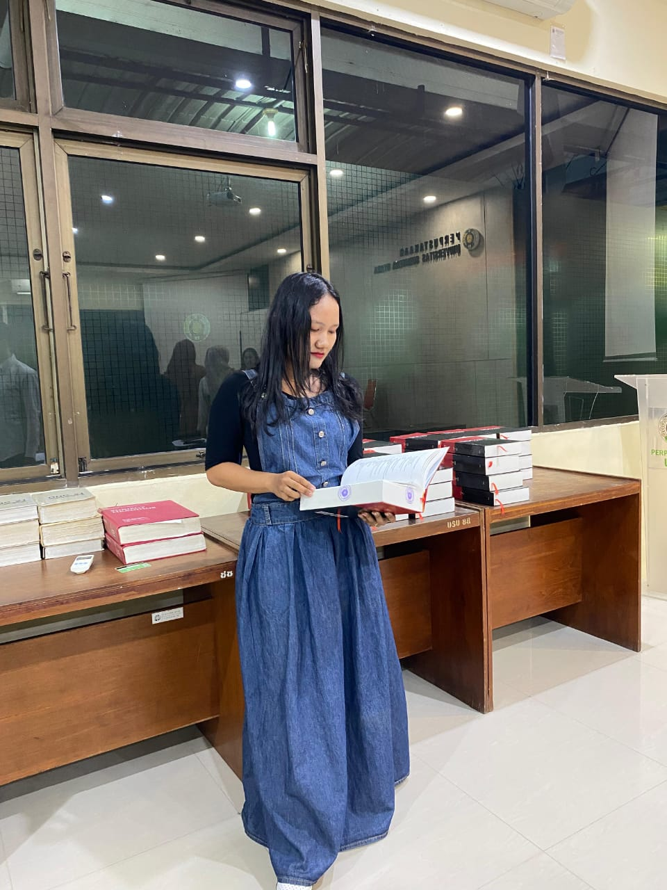

### Hi there 👋

<!--
**StephanieBarus/stephaniebarus** is a ✨ _special_ ✨ repository because its `README.md` (this file) appears on your GitHub profile.

Here are some ideas to get you started:

- 🔭 I’m currently working on ...
- 🌱 I’m currently learning ...
- 👯 I’m looking to collaborate on ...
- 🤔 I’m looking for help with ...
- 💬 Ask me about ...
- 📫 How to reach me: ...
- 😄 Pronouns: ...
- ⚡ Fun fact: ...
-->
<!DOCTYPE html>
<html lang="en">
<head>
    <meta charset="UTF-8">
    <meta http-equiv="X-UA-Compatible" content="IE-Edge">
    <meta name="viewport" content="width=device-width, initial-scale=1.0">
    <title>Stephanie Fransisca Barus Web</title>
    <link rel="stylesheet" href="D:\Bootsrapnew\styles\style.css"/>
</head>
<body>

    <!-- Header -->
    <header>
        
        

            

                

                    <a href="/">SB</a>
            

            <nav>
                <ul class="menu">
                    <li><a href="#hero">Home</a></li>
                    <li>
                        <a href="#">Form</a>
                        <ul class="dropdown">
                            <li><a href="member.html">Member Registration</a></li>
                            <li><a href="bookorder.html">Book Order</a></li>
                            <li><a href="loanrenewal.html">Book Loan Renewal</a></li></ul>
                    </li>
                    <li>
                        <a href="#">Task</a>
                        <ul class="dropdown">
                            <li><a href="otherlibrary.html">Other Library</a></li>
                            <li><a href="audio.html">Audio & Video</a></li>
                        </li>
                        
                    <li><a href="#Book Clasification">Clasification</a></li>
                    <li><a href="#contact">Contact</a></li>
                    </li>
                </ul>
            </nav>

            

                

                

                

            

        

    

</header>
            <section id="hero">
                

                    <h3 class="pre-title">Hello Everyone</h3>
                    <h1 class="hero-name">Welcome to the Blibliofly Library Website</h1>
                    

                        Designed by Stephanie Fransisca Barus (210709041)
                         
                        Library and Information Science
                         
                        This website was created to complete web development course assignments
                         
                        Lecturer: Himma Dewiyana S.T.,M.Hum
                    

                

            
          

            
            </section>
        </header>

            <section id="Books Colection">
                

                    <h3 class="pre-title">Our</h3>
                    <h1 class="section-title Books Colection-title">Book Colection</h1>

                    

                        <!--Books 1-->
                        

                            

                            
                            

                        <h4>Laskar Pelangi</h4>

                        <!--Books 2-->
                        

                            

                            
                            

                        <h4>Hukum Tata Negara Indonesia: Teori,Historis dan Dinamika I </h4>

                        <!--Books 3-->
                        

                            

                            
                            

                        <h4>Foundations of Library and Information Science</h4>
                        

                         
                         
                            <h2> Book</h2>
                            <section id="Book Clasification">
                                

                                    <h3 class="pre-title">Clasification</h3>
                                

                            <Table border="8">
                                <tr align="center">
                                    <th> Title </th>
                                    <th> Creator </th>
                                    <th> Publication Year </th>
                                    <th> ISBN</th>
                                    <th> Call Number </th>
                                </tr>
                                <tr align="center">
                                    <td> Laskar Pelangi </td>
                                    <td> Andrea Hirata </td>
                                    <td> 2005 </td>
                                    <td> 979-3062-79-7 </td>
                                    <td> 813 AND l </td>
                                </tr>
                                <tr align="center">
                                    <td> Hukum Tata Negara Indonesia</td>
                                    <td> Dr.Isnawati, S.H., M.H et.al </td>
                                    <td> 2022 </td>
                                    <td> 978-623-5925-33-2 </td>
                                    <td> 342 ISN h </td>
                                </tr>
                                <tr align="center">
                                    <td> Foundations of Library and Information Science </td>
                                    <td> Richard Rubin </td>
                                    <td> 2016 </td>
                                    <td> 978-0-8389-1370-3 </td>
                                    <td> 020.973 RUB f </td>
                                </tr></Table>
                            

                                 
                    

                

            </section>
                     
                <section id="contact">
                    

                        

                            <form class="contact-form" action="https://formspree.io/f/mleqallq" method="POST">
                                

                                    <input type="text" placeholder="Name" name="name">
                                    

                                    

                                        <input type="email" placeholder="Email" name="email">
                                        

                                        

                                            <textarea
                                            name="message"
                                            id="message"
                                            placeholder="Message"
                                            cols="30"
                                            row="10">
                                        </textarea>
                                    
    
                                    

                                        <button class="btn-submit">Send Message</button>
                                    

                            </form>
                        

                        

                                

                            

                                <svg xmlns="http://www.w3.org/2000/svg" width="24" height="24" viewBox="0 0 24 24"><path d="M12 1c-3.148 0-6 2.553-6 5.702 0 3.148 2.602 6.907 6 12.298 3.398-5.391 6-9.15 6-12.298 0-3.149-2.851-5.702-6-5.702zm0 8c-1.105 0-2-.895-2-2s.895-2 2-2 2 .895 2 2-.895 2-2 2zm8 6h-3.135c-.385.641-.798 1.309-1.232 2h3.131l.5 1h-4.264l-.344.544-.289.456h.558l.858 2h-7.488l.858-2h.479l-.289-.456-.343-.544h-2.042l-1.011-1h2.42c-.435-.691-.848-1.359-1.232-2h-3.135l-4 8h24l-4-8zm-12.794 6h-3.97l1.764-3.528 1.516 1.528h1.549l-.859 2zm8.808-2h3.75l1 2h-3.892l-.858-2z"/></svg>
                            
   
                        

                        

                            <h4>Address</h4>
                            
Middle of Nowhere

                        
  
                        
                        <!--Contact 2-->
                        

                                <svg width="24" height="24" xmlns="http://www.w3.org/2000/svg" fill-rule="evenodd" clip-rule="evenodd"><path d="M2.59 1.322l2.844-1.322 4.041 7.889-2.724 1.342c-.538 1.259 2.159 6.289 3.297 6.372.09-.058 2.671-1.328 2.671-1.328l4.11 7.932s-2.764 1.354-2.854 1.396c-.604.276-1.228.402-1.862.397-5.678-.043-12.143-10.564-12.113-17.454.011-2.351.777-4.279 2.59-5.224zm1.93 1.274l-1.023.504c-5.294 2.762 4.177 21.185 9.648 18.686l.972-.474-2.271-4.383-1.026.501c-3.163 1.547-8.262-8.219-5.055-9.938l1.007-.498-2.252-4.398zm8.98 6.404c.828 0 1.5.672 1.5 1.5s-.672 1.5-1.5 1.5-1.5-.672-1.5-1.5.672-1.5 1.5-1.5zm9 0c.828 0 1.5.672 1.5 1.5s-.672 1.5-1.5 1.5-1.5-.672-1.5-1.5.672-1.5 1.5-1.5zm-4.5 0c.828 0 1.5.672 1.5 1.5s-.672 1.5-1.5 1.5-1.5-.672-1.5-1.5.672-1.5 1.5-1.5z"/></svg>
                            
   
                        

                            <h4>Phone</h4>
                            
(+202)888999810

                        

                        <!--Contact 3-->
                        

                                <svg width="24" height="24" xmlns="http://www.w3.org/2000/svg" fill-rule="evenodd" clip-rule="evenodd"><path d="M24 21h-24v-18h24v18zm-23-16.477v15.477h22v-15.477l-10.999 10-11.001-10zm21.089-.523h-20.176l10.088 9.171 10.088-9.171z"/></svg>
                            
   
                        

                            <h4>E-mail</h4>
                            
stephaniebarus002@gmail.com

                        

                </section>

                <!--Copyright-->
                <footer>
                

                
&#169; 2024 - Made by Stephanie Fransisca Barus

                </footer>
</body>
</html>
